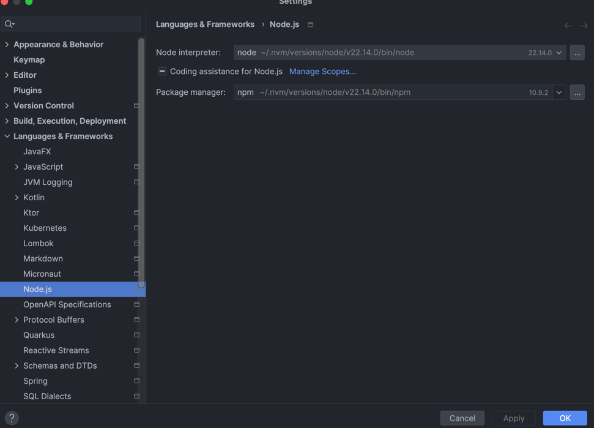

# Node-ToDo-App
- Create Node project
  1. Create empty project in IntelliJ with Javascript
  2. Run `npm init -y` (creates package.json with default setting)
  3. Install dependencies `npm i fastify fastify-swagger uuid` (or any other libraries wanted)
  4. Install dev dependencies `npm i -D nodemon` (this will continuously run server on changes automatically)
- Download dependencies `npm intstall`
- To run the app `npm run dev`
- Configure IDE to recognize Node and turn on "Coding assistance for Node.js"
  - https://www.jetbrains.com/help/idea/developing-node-js-applications.html#ws_node_create_express_app_choose_node

